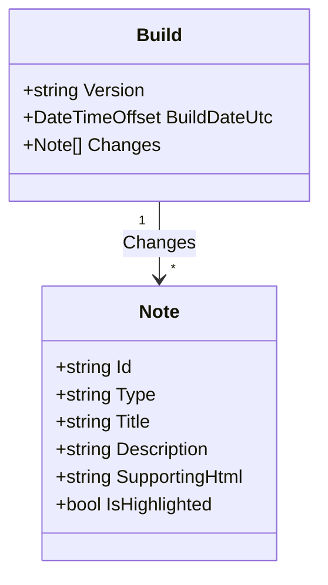

# Outboard
A website for displaying release details across a series of environments.

This project was bootstrapped with [Create React App](https://github.com/facebook/create-react-app).

## "Build" data model
A build represents a new version of a product. Internally the ID of a build will always be the version converted to the form of a slug, while the original version format is maintained in the `Version` property. A series of notes capture the changes that go into the build.



## API

### Send build information
To automatically update your boards, connect Outboard to your CI/CD process. Your CD pipeline should make an HTTP request to your Outboard instance API using cURL or similar, in the format below. The submitted payload can come from anywhere, but it's intended to be mapped from your commit history or the work items linked to your PR.

``` http
POST /api/build/{productId}?code={API_KEY} HTTP/1.1
Host: {yourdomain}
Content-Type: application/json

{
    "version": "1.9.10",
    "buildDateUtc": "2023-02-12T16:08Z",
    "changes": [
        {
            "id": "4839",
            "type": "Feature",
            "title": "Enhanced editing",
            "description": "Added the ability to save widgets after editing",
            "supportingHtml": "Please go <a href=\"https://youtu.be/dQw4w9WgXcQ\">here</a> to learn more.",
            "isHighlighted": true
        },
        {
            "id": "1780",
            "type": "Bugfix",
            "title": "Delete confirm",
            "description": "The confirmation dialog for delete now behaves as expected.",
            "isHighlighted": false
        }
    ]
}
```

### Send deployment information

## Available Scripts

In the project directory, you can run:

### `npm start`

Runs the app in the development mode.\
Open [http://localhost:3000](http://localhost:3000) to view it in your browser.

The page will reload when you make changes.\
You may also see any lint errors in the console.

### `npm test`

Launches the test runner in the interactive watch mode.\
See the section about [running tests](https://facebook.github.io/create-react-app/docs/running-tests) for more information.

### `npm run build`

Builds the app for production to the `build` folder.\
It correctly bundles React in production mode and optimizes the build for the best performance.

The build is minified and the filenames include the hashes.\
Your app is ready to be deployed!

See the section about [deployment](https://facebook.github.io/create-react-app/docs/deployment) for more information.

### `npm run eject`

**Note: this is a one-way operation. Once you `eject`, you can't go back!**

If you aren't satisfied with the build tool and configuration choices, you can `eject` at any time. This command will remove the single build dependency from your project.

Instead, it will copy all the configuration files and the transitive dependencies (webpack, Babel, ESLint, etc) right into your project so you have full control over them. All of the commands except `eject` will still work, but they will point to the copied scripts so you can tweak them. At this point you're on your own.

You don't have to ever use `eject`. The curated feature set is suitable for small and middle deployments, and you shouldn't feel obligated to use this feature. However we understand that this tool wouldn't be useful if you couldn't customize it when you are ready for it.

## Learn More

You can learn more in the [Create React App documentation](https://facebook.github.io/create-react-app/docs/getting-started).

To learn React, check out the [React documentation](https://reactjs.org/).

### Code Splitting

This section has moved here: [https://facebook.github.io/create-react-app/docs/code-splitting](https://facebook.github.io/create-react-app/docs/code-splitting)

### Analyzing the Bundle Size

This section has moved here: [https://facebook.github.io/create-react-app/docs/analyzing-the-bundle-size](https://facebook.github.io/create-react-app/docs/analyzing-the-bundle-size)

### Making a Progressive Web App

This section has moved here: [https://facebook.github.io/create-react-app/docs/making-a-progressive-web-app](https://facebook.github.io/create-react-app/docs/making-a-progressive-web-app)

### Advanced Configuration

This section has moved here: [https://facebook.github.io/create-react-app/docs/advanced-configuration](https://facebook.github.io/create-react-app/docs/advanced-configuration)

### Deployment

This section has moved here: [https://facebook.github.io/create-react-app/docs/deployment](https://facebook.github.io/create-react-app/docs/deployment)

### `npm run build` fails to minify

This section has moved here: [https://facebook.github.io/create-react-app/docs/troubleshooting#npm-run-build-fails-to-minify](https://facebook.github.io/create-react-app/docs/troubleshooting#npm-run-build-fails-to-minify)
